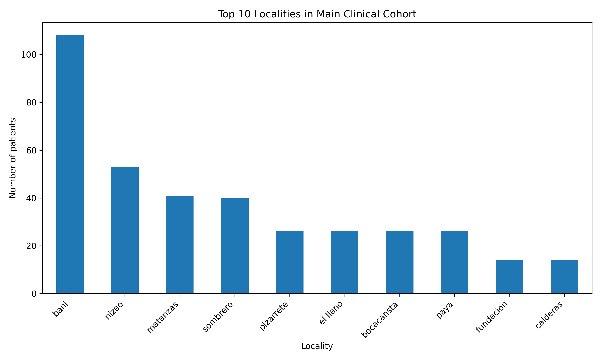

# CKD in Dominican Republic Primary Care: Epidemiology and Social Determinants

Real-world clinical and sociodemographic analysis of chronic kidney disease in primary care in the Dominican Republic




---

## Key Findings

* Chronic kidney disease screening in primary care identified a substantial burden of renal risk and established CKD-related conditions
* Hypertension and diabetes were frequent among screened patients, reinforcing their central role in CKD prevention strategies
* Sociodemographic data highlighted barriers related to education, insurance coverage, and economic limitations in a linked subcohort

---

## Clinical and Public Health Context

Chronic kidney disease (CKD) remains underdiagnosed in many low-resource settings, where early detection, timely referral, and long-term follow-up are often limited.

This project analyzes real-world data collected during a CKD screening initiative in Peravia, Dominican Republic, with the goal of describing clinical burden and exploring selected social determinants of health relevant to kidney care.

Rather than presenting a purely technical workflow, this repository reflects a practical healthcare analytics approach grounded in nephrology, epidemiology, and population health.

---

## Study Design

This project integrates two related datasets collected in the context of community and primary care screening.

### Main Clinical Cohort

* **Source:** UNAPS primary care screening dataset
* **Sample size:** 400 patients
* **Focus:** clinical characterization, CKD-related variables, and major comorbidities

### Nested Sociodemographic Subcohort

* **Source:** structured sociodemographic survey
* **Sample size:** 50 linked patients
* **Focus:** access to care, education, insurance status, and economic barriers

These datasets were not treated as perfectly interchangeable. The integration strategy was designed to preserve methodological transparency and avoid artificial harmonization.

---

## Data Integration Strategy

The sociodemographic dataset was linked to the clinical dataset using a derived numeric identifier extracted from the original UNAPS patient ID.

Because both datasets were collected independently, shared variables were validated after linkage. Inconsistencies were detected in some overlapping fields, especially age.

To preserve data integrity:

* original data were not overwritten
* linkage and validation decisions were documented
* quality-control flags were introduced when inconsistencies were detected
* the sociodemographic analysis was interpreted as a linked subcohort rather than a full merged population

This approach prioritizes transparency over cosmetic cleaning.

---

## Methods

The repository follows a reproducible epidemiological workflow:

1. **Data audit**

   * file inspection
   * structure review
   * sheet validation
   * overlap exploration

2. **Data cleaning**

   * column normalization
   * text standardization
   * categorical harmonization
   * numeric conversion
   * ID standardization

3. **Subcohort construction**

   * derivation of linkage identifiers
   * linkage validation
   * review of overlapping variables

4. **Quality control**

   * detection of age discrepancies
   * consistency checks across linked observations
   * transparent handling of discordant values

5. **Descriptive analysis**

   * demographic summaries
   * CKD classification distribution
   * hypertension and diabetes profiles
   * geographic distribution of screened patients

6. **Sociodemographic analysis**

   * educational level
   * insurance access
   * economic barriers
   * selected healthcare access indicators

---

## Results

### Main Clinical Cohort

The primary care cohort provides a real-world overview of patients evaluated during CKD screening activities in Peravia.

Main descriptive outputs include:

* age distribution
* sex distribution
* hypertension status
* diabetes status
* CKD classification
* most represented localities

### Sociodemographic Subcohort

The linked subcohort adds contextual information that is often missing from purely clinical datasets.

Main descriptive outputs include:

* educational level
* insurance access
* economic barriers affecting care

---

## Interpretation

This project suggests that CKD screening in primary care should not be interpreted only through laboratory or diagnostic categories.

The findings support a broader view in which CKD burden is shaped by:

* high prevalence of major cardiometabolic risk factors
* delayed or incomplete access to healthcare
* social and economic barriers that may affect follow-up and continuity of care

This makes the project relevant not only for descriptive epidemiology, but also for health system planning and prevention-oriented nephrology.

---

## Limitations

* Cross-sectional descriptive design
* Limited linked sociodemographic subcohort compared with the main clinical cohort
* Data collected under real-world field conditions, with expected inconsistencies across instruments
* No longitudinal renal outcomes or follow-up trajectories included in the current version

---

## Why This Matters

This repository demonstrates that clinically meaningful healthcare analytics can be built from real-world primary care data, even when source datasets are imperfect.

It also shows that:

* CKD epidemiology in underserved settings can be explored with transparent methods
* social determinants of health can be incorporated without forcing artificial data fusion
* nephrology-oriented public health analysis can generate practical insights beyond purely technical workflows

---

## Reproducibility

### Requirements

```bash
pip install -r requirements.txt

## Execution Order: 

-python scripts/01_data_audit.py
-python scripts/02_clean_unaps.py
-python scripts/03_clean_sociodemographic.py
-python scripts/04_build_subcohort.py
-python scripts/05_descriptive_analysis.py
-python scripts/06_generate_figures.py

## Main outputs :

-Clinical summary: results/tables/clinical_summary.csv
-CKD distribution: results/tables/ckd_distribution.csv
-Linked subcohort summary: results/tables/subcohort_summary_clean.csv
-Quality flags: results/tables/subcohort_with_quality_flags.csv
-Figures: results/figures/
-Reports: results/reports/
 
## Notes :

This repository preserves the distinction between the main clinical cohort and the linked sociodemographic subcohort.
The analysis prioritizes methodological transparency over forced dataset harmonization.

---

## Scope and Disclaimer

**Status:** cross-sectional descriptive epidemiological study — hypothesis-generating. Not a validated clinical tool, not a medical device, no regulatory clearance. Results must not be used for patient-level decisions. Manuscript in preparation.

**Data provenance:** de-identified real-world data collected during a CKD screening initiative in primary care (UNAPS), Peravia, Dominican Republic. No identifiable patient data are published in this repository.

## Author

**Cristian Arias Ramírez, MD, MSc** — Nephrologist & Internal Medicine Specialist · MSc in Bioinformatics, Universidad Alfonso X el Sabio (2026)

[LinkedIn](https://www.linkedin.com/in/cristian-arias-healthcare-data/) · [Full portfolio](https://github.com/broncox456)
